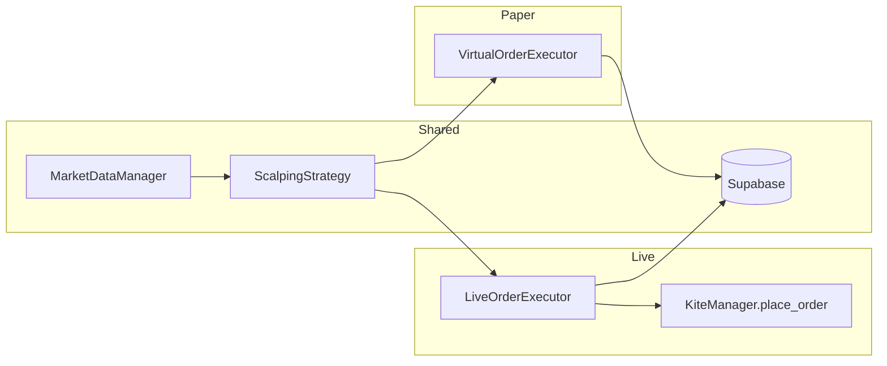

# Live Trading Implementation Plan

Enable live trading alongside the existing paper trading setup without affecting paper. Same strategy (scalping) and same configuration; execution and data are separated by `trading_mode` ('paper' | 'live').

---

## 1. Architecture (high level)

- **Single app, one active mode per run:** At any time the trading loop runs in either **paper** or **live** mode. No mixing: one `TradingManager`, one active `order_executor` (paper or live), one `trading_mode`.
- **Two executors:** Keep [VirtualOrderExecutor](core/virtual_order_executor.py) for paper; add **LiveOrderExecutor** for live. Both implement the same usage pattern: `place_order(signal, price)`, `close_position(symbol, price, reason, ...)`, `positions`, DB persistence with a `trading_mode`.
- **Strategy unchanged:** Scalping (and any future strategy) continues to receive an `order_executor` and call `place_order` / rely on positions; it does not need to know paper vs live.
- **DB already supports both:** Tables `orders`, `positions`, `trades`, `daily_pnl` already have `trading_mode` and are used with filters; no schema change required.

---

## 2. Core changes

### 2.1 Live executor (new file)

- **Add** [core/live_order_executor.py](core/live_order_executor.py).
- **Role:** Execute orders via [KiteManager.place_order](core/kite_manager.py) (NFO, MIS) and persist orders/positions/trades to Supabase with `trading_mode='live'`. Mirror the **interface** used by TradingManager when calling the current executor:
  - `place_order(signal, current_market_price) -> order_id`  
    - Resolve base symbol (strip `_uuid` suffix like [trading_manager._get_option_price](core/trading_manager.py)).  
    - Call `kite_manager.place_order(tradingsymbol=base_symbol, exchange='NFO', transaction_type='BUY'|'SELL', quantity=signal.quantity, order_type='MARKET', product='MIS', validity='DAY')`.  
    - On success: save order and position to DB with `trading_mode='live'`, store Kite `order_id` in order/position records, maintain in-memory `positions` dict (same `Position` type / unique key pattern as paper for consistency).
  - `close_position(symbol, current_price, reason, exit_reason_category)`  
    - Find matching open position (by symbol / unique key), place SELL via Kite, update DB position as closed, release from in-memory `positions`.
  - `positions`, `get_portfolio_summary()`, `get_order_history()`, `get_trade_history()`  
    - Use DB (and in-memory positions for open state) filtered by `trading_mode='live'`. Portfolio summary for live can use `KiteManager.get_funds()` for available cash and current positions for exposure.
  - **Recovery:** On init, load open positions from DB where `trading_mode='live'` into `positions` (same pattern as [VirtualOrderExecutor._recover_positions_from_database](core/virtual_order_executor.py)), and run an orphan check similar to paper (open position with SELL already present -> mark closed).
- **No mocks:** All order placement is real; failures surface as errors and are not silently faked.

### 2.2 VirtualOrderExecutor: use configurable `trading_mode`

- **File:** [core/virtual_order_executor.py](core/virtual_order_executor.py).
- **Change:** Add parameter `trading_mode: str = 'paper'` to `__init__`. Store as `self.trading_mode`. Replace every **hardcoded** `'paper'` in this file with `self.trading_mode` (or the equivalent from the caller). Affected areas:
  - `_recover_positions_from_database`: filter by `self.trading_mode`.
  - `_recover_orphaned_positions`: positions and orders queries use `self.trading_mode`.
  - `_validate_order`: DB position check use `self.trading_mode`.
  - `_execute_order` / order_data and position_data: use `self.trading_mode` instead of `'paper'`.
  - `get_complete_order_history`, `verify_order_integrity`: pass `self.trading_mode` when calling DB.
- **Call site:** When TradingManager creates the paper executor, pass `trading_mode='paper'` explicitly so behavior remains identical.

### 2.3 TradingManager: dual executor + mode at start

- **File:** [core/trading_manager.py](core/trading_manager.py).
- **Init:**
  - Create **two** executors:  
    - `self.paper_executor = VirtualOrderExecutor(initial_capital, self.db_manager, self.kite_manager, trading_mode='paper')`  
    - `self.live_executor = LiveOrderExecutor(self.db_manager, self.kite_manager)` (no virtual capital; live uses Kite funds).
  - Set `self.order_executor = self.paper_executor` and `self.trading_mode = 'paper'` so current behavior is unchanged.
  - In `_initialize_strategies`, keep passing `self.order_executor` (strategies will be updated to the active executor when mode is set).
- **start_trading(strategy_names, mode='paper'):**
  - Add parameter `mode: str = 'paper'`. Validate `mode in ('paper', 'live')`.
  - If already running, enforce same rules as today (single strategy, no mixing). Optionally prevent switching mode while running (require stop then start with new mode).
  - Set `self.trading_mode = mode` and `self.order_executor = self.paper_executor if mode == 'paper' else self.live_executor`.
  - For each strategy in `self.strategies`, set `strategy.order_executor = self.order_executor` so the active strategy uses the correct executor.
  - Then continue with existing logic (market check, active_strategies, trading thread).
- **Force close / DB queries:** Replace the single hardcoded `'paper'` in [trading_manager.py line 950](core/trading_manager.py) (`open_db_positions = ... .eq('trading_mode', 'paper')`) with `self.trading_mode` so force exit and DB fallback work for live as well.
- **Persistence:** In `_save_strategy_states` / `_load_strategy_states`, persist and restore `trading_mode`. **Restore behaviour:** On load, if saved state had `is_trading_active=True` and market is still open, restore the same mode (paper or live): set `self.trading_mode`, `self.order_executor` to the matching executor, restore `active_strategies`, and start the trading loop. Paper and live are treated the same for auto-restore; entry/exit and force-exit logic provide the safety in both modes.

### 2.4 Strategy config (no change)

- Use the **same** [scalping_strategy_config](database) table and [ScalpingStrategy](strategies/scalping_strategy.py) for both paper and live. No duplicate config or mock flags.

---

## 3. Web UI and API

### 3.1 Paper (unchanged)

- Existing routes stay as-is: `/paper`, `/paper/dashboard`, `/paper/orders`, `/paper/positions`. Data source remains **Supabase** (trading_mode='paper'). No changes to data source or page structure.

### 3.2 Live: new pages with Kite as source of truth

Add **separate live trading pages**. For these pages, **orders and positions are fetched directly from Kite** (not from our DB). The live dashboard shows **margin and account details from Kite**.

**New routes and data source:**

| Page                   | Route                        | Data source                                                                   | Purpose                                                                                                |
| ---------------------- | ---------------------------- | ----------------------------------------------------------------------------- | ------------------------------------------------------------------------------------------------------ |
| Live trading dashboard | `/live` or `/live/dashboard` | **Kite** for margin/funds and positions summary; Kite + market data for Nifty | Available margin, used margin, cash, open positions summary, strategy status, Start/Stop live trading. |
| Live trading orders    | `/live/orders`               | **Kite** `kite.orders()`                                                      | Order book: orders placed/modified on Kite (live only).                                                |
| Live trading positions | `/live/positions`            | **Kite** `kite.positions()` (e.g. day positions)                              | Open/closed positions from Kite.                                                                       |

**Live dashboard – metrics from Kite:**

- **Available margin / cash:** From [KiteManager.get_funds()](core/kite_manager.py) (uses `kite.margins()` - equity - available live_balance/cash, utilised debits). Display available cash, used margin, total margin (or equivalent fields returned by get_funds()).
- **Positions summary:** From [KiteManager.get_positions()](core/kite_manager.py) (e.g. day positions) for count and PnL summary.
- **Strategy status:** From TradingManager (is live strategy running, which strategy). Start/Stop live trading buttons call existing start_trading/stop_trading with `mode='live'`.

**Live orders page:**

- Call Kite API for order list (e.g. `kite_manager.get_orders()`). Display order_id, symbol, type, quantity, price, status, time, etc. No DB filter; show what Kite has. Optionally filter to current day or last N orders in the backend for clarity.

**Live positions page:**

- Call Kite API for positions (e.g. `kite_manager.get_positions()` - day or net). Display tradingsymbol, quantity, entry price, LTP, PnL, product, etc. No DB as source for this view.

**Navigation:**

- Navbar: add links to **Live dashboard**, **Live orders**, **Live positions** so users can switch between Paper and Live sections. Paper links unchanged (Dashboard, Orders, Positions). Live links: Live dashboard, Live orders, Live positions.

**APIs for live pages:**

- **GET /api/live/funds** (or include in dashboard response): Return `kite_manager.get_funds()` for the live dashboard. Require auth.
- **GET /api/live/orders**: Return `kite_manager.get_orders()` (or filtered). Used by live orders page.
- **GET /api/live/positions**: Return `kite_manager.get_positions()` (e.g. day). Used by live positions page.
- **GET /api/live/dashboard** (optional): Aggregate funds + positions summary + strategy status for one-shot dashboard load; or the live dashboard can call funds + positions + existing trading-status API with a flag for live.

**Start/Stop live trading:**

- From the **live dashboard**, "Start live trading" sends POST `/api/start-trading` with `{ "strategies": ["scalping"], "mode": "live" }` after user confirmation. "Stop" sends POST `/api/stop-trading`. Require explicit confirmation (e.g. modal) for "Start live trading" (real money).

**DB vs Kite:**

- Our DB is still used when **we** place/close orders (LiveOrderExecutor writes to Supabase for audit and for the trading loop). The **live UI** reads orders and positions **from Kite** so the user sees the real broker state. Margin/funds on the live dashboard also come from Kite only.

---

## 4. Files to add

| File                                                                         | Purpose                                                                                                                                                               |
| ---------------------------------------------------------------------------- | --------------------------------------------------------------------------------------------------------------------------------------------------------------------- |
| [core/live_order_executor.py](core/live_order_executor.py)                   | Live execution via KiteManager.place_order; same interface as VirtualOrderExecutor for place_order, close_position, positions, recovery, DB with trading_mode='live'. |
| [web_ui/templates/live_dashboard.html](web_ui/templates/live_dashboard.html) | Live trading dashboard: margin/funds and positions summary from Kite, strategy status, Start/Stop live trading (with confirmation for start).                         |
| [web_ui/templates/live_orders.html](web_ui/templates/live_orders.html)       | Live orders page: table of orders from Kite (kite_manager.get_orders()).                                                                                              |
| [web_ui/templates/live_positions.html](web_ui/templates/live_positions.html) | Live positions page: table of positions from Kite (kite_manager.get_positions()).                                                                                     |

---

## 5. Files to modify (summary)

| File                                                                                            | Changes                                                                                                                                                                                                                                                                                                                                                                                                                                                                                                                                        |
| ----------------------------------------------------------------------------------------------- | ---------------------------------------------------------------------------------------------------------------------------------------------------------------------------------------------------------------------------------------------------------------------------------------------------------------------------------------------------------------------------------------------------------------------------------------------------------------------------------------------------------------------------------------------- |
| [core/virtual_order_executor.py](core/virtual_order_executor.py)                                | Add `trading_mode` parameter; replace all hardcoded `'paper'` with `self.trading_mode`.                                                                                                                                                                                                                                                                                                                                                                                                                                                        |
| [core/trading_manager.py](core/trading_manager.py)                                              | Create paper_executor and live_executor; set order_executor and trading_mode from `mode` in start_trading; sync strategy.order_executor; fix force-close DB query to use self.trading_mode; persist/restore trading_mode in state; auto-restore both paper and live when saved state had that mode running and market is open.                                                                                                                                                                                                                 |
| [web_ui/app.py](web_ui/app.py)                                                                  | Add routes: `/live`, `/live/dashboard`, `/live/orders`, `/live/positions` (render live_dashboard.html, live_orders.html, live_positions.html). Add APIs: GET `/api/live/funds`, GET `/api/live/orders`, GET `/api/live/positions` (and optionally GET `/api/live/dashboard` aggregating funds + positions + status), all using KiteManager (get_funds, get_orders, get_positions). Accept `mode` in POST `/api/start-trading` and POST `/api/strategy/<name>/start`; pass mode to trading_manager.start_trading. All live routes require auth. |
| [web_ui/templates/paper_dashboard.html](web_ui/templates/paper_dashboard.html) (and shared nav) | Add navigation links to Live dashboard, Live orders, Live positions (e.g. in navbar) so users can reach the new live pages. Paper pages unchanged; no mode selector on paper.                                                                                                                                                                                                                                                                                                                                                                  |

---

## 6. Schema alignment (Supabase)

Your `orders` and `positions` tables already support both modes. Implementation must match these constraints and FKs.

**orders**

- `id` (uuid, PK): Our DB primary key; returned on INSERT and used for position linkage.
- `order_id` (varchar 100, nullable): Store **Kite’s order ID string** here for audit (live only; paper can keep current behaviour).
- `trading_mode`: `'paper'` | `'live'` (check constraint).

**positions**

- `buy_order_id` (uuid, FK → orders.id, ON DELETE SET NULL): Must be set to the **DB uuid** of the BUY order row when creating the position. Do not store Kite order id here.
- `sell_order_id` (uuid, FK → orders.id): Must be set to the **DB uuid** of the SELL order row when closing the position.
- Unique index `idx_positions_unique_buy_order`: (buy_order_id) WHERE is_open = true AND buy_order_id IS NOT NULL → one open position per BUY order. Both paper and live must INSERT one order row per BUY, then one position row with `buy_order_id = orders.id` for that row.

**Live executor flow**

- **BUY:** Call Kite → get Kite order_id string. INSERT into `orders` (strategy_name, trading_mode='live', symbol, order_type='BUY', quantity, price, order_id=*kite_order_id*, status='COMPLETE', filled_quantity, filled_price, signal_data). Get back `id` (uuid). INSERT into `positions` (strategy_name, trading_mode='live', symbol, quantity, average_price, ..., is_open=true, **buy_order_id=orders.id**). In-memory position can store both the DB position id and Kite order_id for reference.
- **SELL (close):** INSERT into `orders` (SELL row, trading_mode='live', ...). Get back `id` (uuid). UPDATE `positions` SET sell_order_id=*that id*, is_open=false, exit_time, exit_price, exit_reason, realized_pnl, etc. Then remove from in-memory positions.

**Paper executor**

- Same linkage: when saving order, use the returned `orders.id` (uuid) as `buy_order_id` / `sell_order_id` in positions. VirtualOrderExecutor already uses `database_id` in metadata; ensure it passes the DB uuid into `db_manager.save_position(..., buy_order_id=database_order_id)` so the FK and unique index are satisfied.

---

## 7. Loose ends and safety

- **Kite symbol format:** Signal symbols may have a suffix (e.g. `NIFTY25D2325850CE_03448d82`). Strip the suffix before calling Kite (use base symbol); reuse the same logic as in `_get_option_price` where applicable.
- **Order ID:** Store Kite’s order ID in `orders.order_id` (varchar). Use the DB `orders.id` (uuid) for `positions.buy_order_id` and `positions.sell_order_id` so FKs and the unique index are satisfied (see Schema alignment above).
- **Errors:** If Kite place_order fails, return empty order_id (or raise); do not create a synthetic success. Log clearly so debugging is straightforward.
- **No mock/feature flags:** Do not add mock live or feature flags; live is real execution only.
- **Env:** Existing `TRADING_MODE` in [config/settings.py](config/settings.py) can remain for reference; runtime mode is determined by the start-trading call and persisted state, not by a global env switch that could accidentally flip live on.

---

## 8. Testing suggestions (no mocks)

- Paper: Run scalping in paper mode; confirm orders/positions/trades and DB remain as today.
- Live (with caution): Run scalping in live mode in a test account; confirm orders appear on Kite and in DB with `trading_mode='live'`, and force close / exit logic works.
- Mode switch: Start paper, stop; start live (or vice versa) and confirm the correct executor and DB filters are used.
- Restart: With live running, restart app during market hours and confirm live auto-restores (same as paper). After stopping live, restart and confirm live does not start (saved state has is_trading_active=False).

This plan keeps paper and live independent, reuses the same strategy and config, avoids mocks, and ties execution and data strictly to `trading_mode` with minimal changes to existing paper behavior.